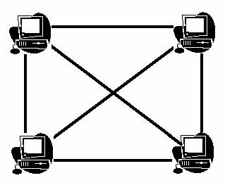

**Connect the Computers**

There has **N** number of computers and every computer is connected directly by the cable with each other. Let observe the network-

========================================================

The problem is- if N number of computers is connected then how many cables are needed to create the network among these N computers?
====================================================================================================================================

**Input**

Each line has a non-negative integer **N** ≤ 25, number of computers to be connect.

**Output**

For each input, produce output in one line.

**Sample Input**

2

3

4

**Output**

1

3

6

* * *

Problem Setter: Tariq Newaz Shahriar
