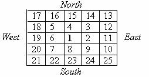

## Where Am I Looking At

There has a spiral tap. Spiral tap is a kind of coil of consecutive number where number 1 is start from the middle point of the coil. For instance- consider a 5X5 spiral tap and the directions-



You are walking through every grid of this tap. You started from position 1 and always look at the next number of the grid (where you will go next). Suppose, you are in grid 5. So you are looking at position 6 at South. You have a campus with you. Now you are in position **P,** tell-which direction are you looking at now?

### Input
The input file contains several lines of input. Each line contains an integer number **P** **(0<=P<=1,00,000)** which indicates your current position. End of file terminates input.

### Output
For each line of input, produce one line of output containing a sentence

**I look at North/South/East/West**. Display only the correct direction.

### Sample Input
```
10

5

60
```

### Sample Output
```
I am looking at North

I am looking at South

I am looking at West
```

---
Problem Setter: Khaled Mahmood Shahriar
